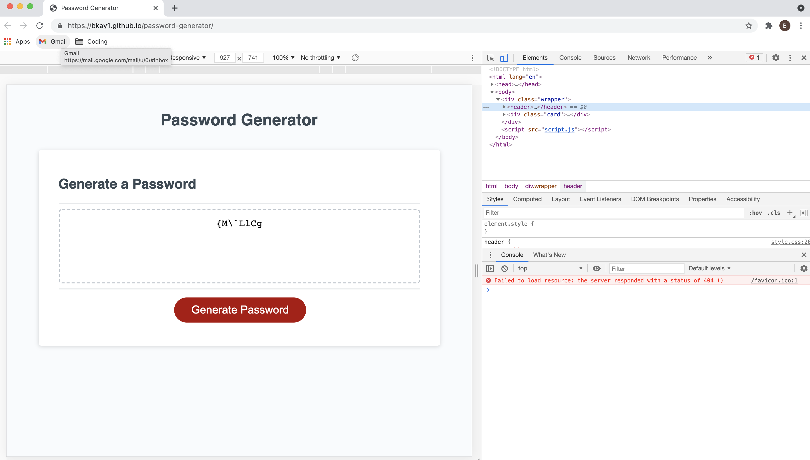

# Project: Password Generator

# Task

To create a working random password generator. The generated password must be of numeric value and between 8 and 128 characters and dependant on user preference contain one of the following characters: lowercase, uppercase, special or numeric characters.

# Methodology

Main Actions:

1.  Drafted a wireframe outlining the main tasks of generating a password with user input;
2.  Wrote the main actions in script.js;
3.  Drafted the prompts and alerts to obtain user character type preferences for a password and ensuring that the password was of numeric value and between 8 and 128 characters.
4.  Utilised .push to ensure user preference was captured;
5.  Used Math.floor and Math.Random to randomise the characters requested by user;
6.  Used .join to join the password from character options selected in step 5.
7.  The password generator was successful in being able to generate a multiple character and length password.

# Screenshots

Please note screen shots of working web app:

Image 1 to show deployed application URL: 

Image 2 to show generated password with no errors in console URL: 

# Link to GitHub Repository:

https://github.com/BKay1/password-generator

# Link to Deployed Application:

https://bkay1.github.io/password-generator/
